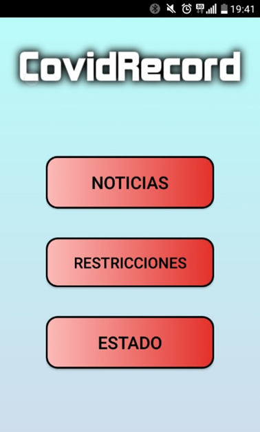

# CovidRecord

**Proyecto de Android** para el Grado Superior de Desarrollo de Aplicaciones Multiplataforma (DAM)

**Nuestra App:** CovidRecord

## Descripción

Aplicación de información de protocolos COVID-19 basado en la ubicación del usuario. La aplicación registra cuando un usuario ha estado en contacto durante "X" tiempo con otro usuario en una BBDD (FireBase). En el caso de que uno de los contactos se contagie y lo avise, una notificación PUSH es mandada. La aplicación también tendrá una página de noticias relevantes a la situación de la pandemia y las posibles restricciones de su zona.

## Requisitos de la app

La app requerirá geolocalización para mostrar las restricciones de su zona.
Acceso a base de datos para el registro de contactos.
Acceso a Internet para el boletín de noticias y para mostrar las medidas de la zona.

## Integrantes del grupo 

Iustin Mocanu.
Iván Moriche.
Rodrigo García.

**Repositorio GitHub**
https://github.com/Ivan0886/APPCovid
